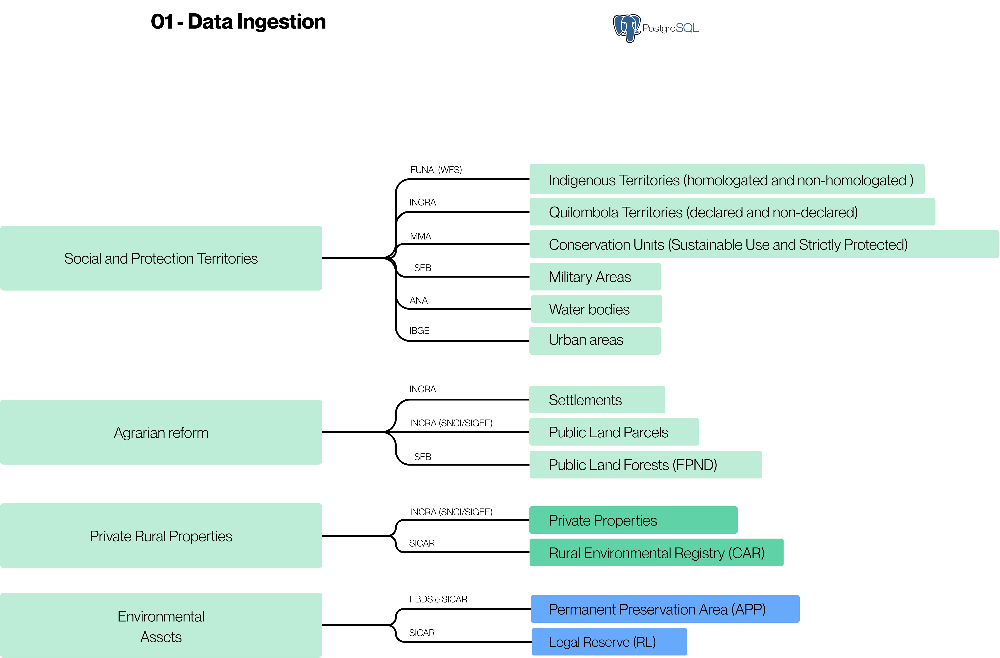

# 01. Data Ingestion

This stage consists of the acquisition, organization, and storage of the main land tenure and environmental databases used in the construction of the Enviromental Land Tenure Dataset. The data are obtained from official sources and integrated into a structured **PostgreSQL** database environment, ensuring standardization and traceability (iGPP, 2025).

## Data Structure

The data are organized into four main groups:

* Social and protection territories
* Agrarian reform
* Private rural properties
* Environmental assets

** **

## Data Sources

#### Social and Protection Territories
| Data | Source | URL |
| :--- | :--- | :--- |
| Indigenous Territories (homologated and non-homologated) | FUNAI (WFS) | [https://geoserver.funai.gov.br/geoserver/Funai/ows?service=WFS&version=1.0.0&request=GetFeature&typeName=Funai%3Atis_poligonais&maxFeatures=10000&outputFormat=SHAPE-ZIP](https://geoserver.funai.gov.br/geoserver/Funai/ows?service=WFS&version=1.0.0&request=GetFeature&typeName=Funai%3Atis_poligonais&maxFeatures=10000&outputFormat=SHAPE-ZIP) |
| Quilombola Territories (declared and non-declared) | INCRA | [https://certificacao.incra.gov.br/csv_shp/export_shp.py](https://certificacao.incra.gov.br/csv_shp/export_shp.py) |
| Conservation Units (Sustainable Use and Strictly Protected) | MMA | [https://dados.gov.br/dados/conjuntos-dados/unidadesdeconservacao](https://dados.gov.br/dados/conjuntos-dados/unidadesdeconservacao) |
| Military Areas | SFB | [https://mapas.florestal.gov.br/portal/home/item.html?id=7d477c1d52eb41028a9f0e04036206b8](https://mapas.florestal.gov.br/portal/home/item.html?id=7d477c1d52eb41028a9f0e04036206b8) |
| Water Bodies | ANA | [https://dadosabertos.ana.gov.br/datasets/4c606c38ee534b84bffe70ca6c8552c6_0/about](https://dadosabertos.ana.gov.br/datasets/4c606c38ee534b84bffe70ca6c8552c6_0/about) |
| Urban Areas | IBGE | [https://www.ibge.gov.br/geociencias/cartas-e-mapas/redes-geograficas/15789-areas-urbanizadas.html?=&t=downloads](https://www.ibge.gov.br/geociencias/cartas-e-mapas/redes-geograficas/15789-areas-urbanizadas.html?=&t=downloads) |

#### Agrarian Reform
| Data | Source | URL |
| :--- | :--- | :--- |
| Settlements | INCRA | [https://certificacao.incra.gov.br/csv_shp/export_shp.py](https://certificacao.incra.gov.br/csv_shp/export_shp.py) |
| Public Lands (Parcels)| INCRA (SNCI/SIGEF) | [https://certificacao.incra.gov.br/csv_shp/export_shp.py](https://certificacao.incra.gov.br/csv_shp/export_shp.py) |
| Public Land Forests (FPND) | SFB | [https://mapas.florestal.gov.br/portal/home/item.html?id=7d477c1d52eb41028a9f0e04036206b8](https://mapas.florestal.gov.br/portal/home/item.html?id=7d477c1d52eb41028a9f0e04036206b8) |

#### Private Rural Properties
| Data | Source | URL |
| :--- | :--- | :--- |
| Private properties | INCRA (SNCI/SIGEF) | [https://certificacao.incra.gov.br/csv_shp/export_shp.py](https://certificacao.incra.gov.br/csv_shp/export_shp.py) |
| Rural Environmental Registry (CAR) | SICAR | [https://consultapublica.car.gov.br/publico/imoveis/index](https://consultapublica.car.gov.br/publico/imoveis/index) |

#### Environmental Assets
| Data | Source | URL |
| :--- | :--- | :--- |
| Permanent Preservation Area (APP) | FBDS and SICAR | [https://geo.fbds.org.br/](https://geo.fbds.org.br/) |
| Legal Reserve (RL) | SICAR | [https://consultapublica.car.gov.br/publico/imoveis/index](https://consultapublica.car.gov.br/publico/imoveis/index) |

The land tenure layers—Indigenous Lands, Conservation Units, Quilombola Lands, Public Land Forests (FPND) and Military area filtered in the original database to separate them by status (iGPP,2025).

| Layers | Field | Filter |
| :--- | :--- | :--- |
| Indigenous Territories - homologated| fase_ti | fase_ti in ('Homologada','Regularizada')|
| Indigenous Territories - non-homologated| fase_ti |not fase_ti in ('Homologada','Regularizada')|
| Quilombola Territories  - declared| fase| fase not in ('Contestação','EDITAL','RTID','RTID - CONTRADITORIO') and is not NULL| 
| Quilombola Territories - non-declared| fase | fase in ('Contestação','EDITAL','RTID','RTID - CONTRADITORIO') and is not NULL | 
| Conservation Units  - Sustainable Use| grupo| grupo = 'Uso Sustentável'| 
| Conservation Units  - Strictly Protected| grupo | grupo = 'Proteção Integral'| 
| Public Land Forests (FPND)| tipo| tipo = 'Tipo B' |
| Military area| classe| classe = 'USO MILITAR' |

The integration of these bases constitutes the starting point for the following processing stages, where topological corrections, overlap resolution, and integration with environmental assets are performed.
