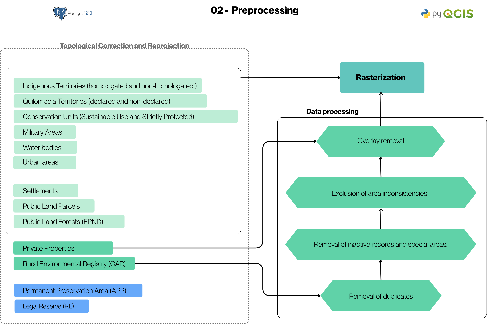

# 02. Data Preprocessing

In this stage, the data integrated into the PostgreSQL database undergo geometric corrections and filtering, with the aim of ensuring spatial consistency, feature integrity, and reliability in subsequent processes.

## How it Works

01. **Topological Correction and Reprojection:** Geometric inconsistencies are eliminated and all layers are reprojected to a standard metric system (ESRI:102033 — Albers Equal Area Conic).
02. **Removal of duplicates:** Duplicate records are identified and removed, keeping the most recent record.
03. **Removal of inactive records and special areas:** Properties with "Cancelled" or "Suspended" status are excluded, as well as categories that have more reliable representation in other official databases, such as special areas.
04. **Exclusion of area inconsistencies:** CAR properties with an area equal to or greater than the area of the municipality are removed, avoiding distortions associated with digital land grabbing.
05. **Overlap removal:** Overlaps are resolved by prioritizing the most recent record and making spatial adjustments in relation to the INCRA (SIGEF/SNCI) and CAR databases.To evaluate the CAR (Rural Environmental Registry) data with and without overlap, it was assumed that a CAR property is considered without overlap if it meets the following criteria: up to 4 fiscal modules with up to 10% overlap; between 4 and 15 fiscal modules with up to 5% overlap; and above 15 fiscal modules with up to 3% overlap. Properties exceeding these thresholds were classified as having an overlap. Small properties are prioritized over large ones, with feature clipping.
06. **Rasterization:** All layers are converted to raster format with a 10-meter pixel, compatible with a 1:25,000 scale, allowing spatial standardization and the application of the subsequent analysis stages.


## Flowchart


Figure 2 - Preprocessing Flowchart

## Example of area inconsistencies


Figure 3 - Example of area inconsistencies

### Code for processing INCRA data
<details>
<summary>Tips for collapsed sections</summary>

```python
# Import modules
from qgis.core import  QgsProject, QgsVectorLayer, QgsFeatureRequest, QgsFeature, QgsApplication,QgsDataSourceUri, QgsSpatialIndex,QgsGeometry,QgsField
from qgis import processing
import sys
from qgis.analysis import QgsNativeAlgorithms
import os
from PyQt5.QtCore import QVariant
import glob
import shutil
import time
import datetime

# Standalone Environment Configuration
qgis_prefix = r'C:\Program Files\QGIS 3.xx\apps\qgis'
QgsApplication.setPrefixPath(qgis_prefix, True)
qgs = QgsApplication([], False)
qgs.initQgis()

sys.path.append(r'C:\PROGRA~1\QGIS34~1.4\apps\qgis\python\plugins')

import processing
from processing.core.Processing import Processing
Processing.initialize() 

# 4. Add native algorithms
QgsApplication.processingRegistry().addProvider(QgsNativeAlgorithms())

def analisar_sobreposicao_otimizado(layer_path, saida):
    
    #print(f"Reading file: {os.path.basename(layer_path)}")
    layer = layer_path # QgsVectorLayer(layer_path, "camada_entrada", "memory")
    
    # 1. We load the features and already sort them by area (Smaller -> Priority)
    features_ordenadas = sorted([f for f in layer.getFeatures()], key=lambda f: f.geometry().area())
    
    layer_resultado = QgsVectorLayer(f"Polygon?crs={layer.crs().authid()}", "resultado", "memory")
    layer_resultado.dataProvider().addAttributes(layer.fields())
    layer_resultado.updateFields()

    # 2. DYNAMIC SPATIAL INDEX
    # Instead of a static list, we use the index to filter candidates for clipping
    index = QgsSpatialIndex()
    
    # Dictionary to retrieve processed geometries via ID
    processed_geoms = {} 

    print("Starting hierarchical clipping with spatial filter...")
    
    #with edit(layer_resultado): # Use of the context manager for block commit
    
    for i, feat in enumerate(features_ordenadas):
            geom_atual = feat.geometry()
            
            # SPATIAL SEARCH: Gets only IDs of geometries that intersect the bounding box of the current one
            candidate_ids = index.intersects(geom_atual.boundingBox())
        
            for c_id in candidate_ids:
                geom_fixa = processed_geoms[c_id]
                if geom_atual.intersects(geom_fixa):
                    geom_atual = geom_atual.difference(geom_fixa)
                    if geom_atual.isEmpty():
                       break
            
            if not geom_atual.isEmpty() and geom_atual.area() > 1.0:
                feat.setGeometry(geom_atual)
                layer_resultado.dataProvider().addFeatures([feat])
                
                # ADDS TO THE INDEX for the next properties
                new_id = feat.id()
                index.addFeature(feat)
                processed_geoms[new_id] = geom_atual

            if i % 500 == 0:
                print(f"Processed: {i}/{len(features_ordenadas)} properties. Stable memory.")

    processing.run("native:savefeatures", {'INPUT': layer_resultado, 'OUTPUT': saida})
   

def consolidar_malhas_qgis(saida):
    """
    Uses the QGIS processing engine to prioritize the SIGEF mesh.
    """
    # Load layers
    uri = QgsDataSourceUri()
    uri.setConnection("localhost", "5432", "postgis", "postgres", "123456")    
    
    uri.setDataSource("mfa", "13_malha_fundiaria_gleba_publica_sigef", "geom")
    layer_sigef = QgsVectorLayer(uri.uri(), "SIGEF_PostGIS", "postgres")
    
    uri.setDataSource("mfa", "13_malha_fundiaria_gleba_publica_snci", "geom")
    layer_snci = QgsVectorLayer(uri.uri(), "SNCI_PostGIS", "postgres")
    
    
    print('Fixing SIGEF geometry')
    fix_geo_sigef = processing.run("native:fixgeometries", {
        'INPUT': layer_sigef,
        'OUTPUT': 'memory:fix_sigef'
    })['OUTPUT']
    
    print('Fixing SNCI geometry')
    fix_geo_snci = processing.run("native:fixgeometries", {
        'INPUT': layer_snci,
        'OUTPUT': 'memory:fix_snci'
    })['OUTPUT']
    
    if not layer_sigef.isValid() or not layer_snci.isValid():
        print("Error loading layers. Check the paths.")
        return

    print("Starting clip of SNCI base...")

    # 2. Run 'Difference': Removes from SNCI what is overlapped by SIGEF
    # This ensures there will be no geometric duplication.
    params_diff = {
        'INPUT': fix_geo_snci,
        'OVERLAY': fix_geo_sigef,
        'OUTPUT': 'memory:SNCI_Recortado'
    }
    result_diff = processing.run("native:difference", params_diff)
    snci_recortado = result_diff['OUTPUT']

    print("Cleaning topological residuals (Slivers)...")
    
    # 3. Optional: Filter irrelevant polygons generated by the clip (e.g. < 1m2)
    # In QGIS, this can be done via expression selection
    snci_recortado.setSubsetString("area($geometry) > 5")

    print("Unifying layers...")

    # 4. Merge the layers: SIGEF (intact) + SNCI (only non-certified areas)
    #outputFile = output
    params_merge = {
        'LAYERS': [layer_sigef, snci_recortado],
        'CRS': 'ESRI:102033',
        'OUTPUT': 'memory:Malha_Consolidada_Final'
    }
    result_final = processing.run("native:mergevectorlayers", params_merge)['OUTPUT']
    
    print("Process completed. Layer 'Malha_Consolidada_Final' added.")
    analisar_sobreposicao_otimizado(result_final,saida)
 

# Example call (adjust paths to your reality):
saida = input('Enter the output file:')

# Start of processing
print('Start of processing',datetime.datetime.now())

# INCRA / SNCI Integration
consolidar_malhas_qgis(saida)

# End of processing
print('End of processing', datetime.datetime.now())

# Clean Finalization
qgs.exitQgis()
```

</details>

### Code for processing Rural Environmental Registry (CAR) data

<details>
<summary>Tips for collapsed sections</summary>

```python
# Import modules
from qgis.core import  QgsProject, QgsVectorLayer, QgsFeatureRequest, QgsFeature, QgsApplication,QgsDataSourceUri, QgsSpatialIndex,QgsGeometry
from qgis import processing
import sys
from qgis.analysis import QgsNativeAlgorithms
import os
import datetime

# Standalone Environment Configuration
qgis_prefix = r'C:\Program Files\QGIS 3.xx\apps\qgis'
QgsApplication.setPrefixPath(qgis_prefix, True)
qgs = QgsApplication([], False)
qgs.initQgis()

sys.path.append(r'C:\PROGRA~1\QGIS34~1.4\apps\qgis\python\plugins')

import processing
from processing.core.Processing import Processing
Processing.initialize() 

# 4. Add native algorithms
QgsApplication.processingRegistry().addProvider(QgsNativeAlgorithms())


# Save excluded layers
def salvar_camada_excluidos(lista_feicoes, campos, pasta_saida, nome_arquivo):
    """
    Creates a GeoPackage to store features that were blocked at any stage.
    """
    if not lista_feicoes:
        return

    # Define the full path
    caminho_final = os.path.join(pasta_saida, nome_arquivo)
    
    # 2. Create a temporary layer in memory with the same structure as the original layer
    # We use MultiPolygon because it is the CAR standard
    uri = "MultiPolygon?crs=EPSG:4674" # Or use the CRS of your original layer
    camada_temp = QgsVectorLayer(uri, "temp_excluidos", "memory")
    provider = camada_temp.dataProvider()

    # 3. Add original fields + the reason field (in case it does not exist in the passed fields)
    provider.addAttributes(campos)
    camada_temp.updateFields()

    # 4. Add features to the memory layer
    provider.addFeatures(lista_feicoes)

    # 5. Save the memory layer in a GeoPackage file on disk
    params = {
        'INPUT': camada_temp,
        'OUTPUT': caminho_final,
        'LAYER_NAME': 'excluidos',
        'DATASOURCE_OPTIONS': '',
        'LAYER_OPTIONS': ''
    }
    
    # native:savefeatures is the safest command to export files in QGIS Standalone
    processing.run("native:savefeatures", params)
    print(f"--> Audit file generated: {nome_arquivo} ({len(lista_feicoes)} features)")


def analisar_sobreposicao_car(layer,outfolder):
    
    if not os.path.exists(outfolder): os.makedirs(outfolder)
    coluna_modulo = 'mod_fical_calc' # Make sure this name is correct in your database
    
    print(f"[{datetime.datetime.now().strftime('%H:%M:%S')}] Creating Spatial Index and Cache...")
    all_features = {f.id(): f for f in layer.getFeatures()}
    geom_cache = {f.id(): f.geometry() for f in all_features.values()}
    index = QgsSpatialIndex(layer.getFeatures())
    
    ids_com_sobreposicao = []

    print(f"[{datetime.datetime.now().strftime('%H:%M:%S')}] Analyzing overlap tolerances...")
    for f_id, feat in all_features.items():
        geom = feat.geometry()
        area_original = geom.area()
        if area_original <= 0: continue
        
        # Gets the fiscal module value of the current property
        val_modulo = feat.attribute(coluna_modulo)
        if val_modulo is None:
            val_modulo = 0 
            
        # Tolerance threshold to consider CAR Property overlap
        if val_modulo < 4.0:
            limite_tolerancia = 10.0
        elif 4.0 <= val_modulo <= 15.0:
            limite_tolerancia = 5.0
        else: # Above 15
            limite_tolerancia = 3.0
        # -----------------------------------------

        candidates = index.intersects(geom.boundingBox())
        inter_area = 0
        
        for c_id in candidates:
            if c_id == f_id: continue
            other_geom = geom_cache[c_id]
            
            # Only calculates real intersection if there is contact
            if geom.intersects(other_geom):
                intersection = geom.intersection(other_geom)
                inter_area += intersection.area()
                
                # Optimization: If it has already exceeded the limit, no need to sum the rest
                if (inter_area / area_original) * 100 > limite_tolerancia:
                    break
        
        if (inter_area / area_original) * 100 > limite_tolerancia:
            ids_com_sobreposicao.append(f_id)

    # --- 1. Export WITHOUT Overlap (Accepted within tolerance) ---
    print(f"Exporting accepted CAR (within tolerance)...")
    path_sem = os.path.join(outfolder, 'car_aceito_tolerancia.gpkg')
    fids_sem = list(set(all_features.keys()) - set(ids_com_sobreposicao))
    
    temp_sem = QgsVectorLayer(f"MultiPolygon?crs={layer.crs().authid()}", "sem_sob", "memory")
    temp_sem.dataProvider().addAttributes(layer.fields())
    temp_sem.updateFields()
    temp_sem.dataProvider().addFeatures([all_features[fid] for fid in fids_sem])
    processing.run("native:savefeatures", {'INPUT': temp_sem, 'OUTPUT': path_sem})

    # --- 2. Process WITH Overlap (Hierarchical Clipping) ---
    print(f"[{datetime.datetime.now().strftime('%H:%M:%S')}] Starting Hierarchical Clipping of conflicts...")
   
    # The rest of the sorting and clipping code remains the same to ensure topology
    print(f"Sorting {len(ids_com_sobreposicao)} properties for clipping...")
    
    feats_sob = [all_features[fid] for fid in ids_com_sobreposicao]
    feats_ordenadas = sorted(feats_sob, key=lambda f: f.attribute(coluna_modulo) or 999999)

    path_com_recortado = os.path.join(outfolder, 'car_conflitos_resolvidos.gpkg')
    layer_resultado = QgsVectorLayer(f"MultiPolygon?crs={layer.crs().authid()}", "resultado", "memory")
    layer_resultado.dataProvider().addAttributes(layer.fields())
    layer_resultado.updateFields()

    processed_index = QgsSpatialIndex()
    processed_geoms = {}

    print("Starting hierarchical clipping...")
    
    ids_excluidos_conflito = []

    for i, feat in enumerate(feats_ordenadas):
            geom_atual = feat.geometry()
            
            # Searches only for those already processed and nearby
            candidates = processed_index.intersects(geom_atual.boundingBox())
            for c_id in candidates:
                geom_fixa = processed_geoms[c_id]
                if geom_atual.intersects(geom_fixa):
                    geom_atual = geom_atual.difference(geom_fixa)
                    if geom_atual.isEmpty(): 
                        break
            
            if not geom_atual.isEmpty() and geom_atual.area() > 1.0:
                #feat.setGeometry(geom_atual)
                #layer_resultado.addFeature(feat)
                #processed_index.addFeature(feat)
                #processed_geoms[feat.id()] = geom_atual
                feat.setGeometry(geom_atual)
                layer_resultado.dataProvider().addFeatures([feat])
                
                # ADDS TO THE INDEX for the next properties
                new_id = feat.id()
                processed_index.addFeature(feat)
                processed_geoms[new_id] = geom_atual
            else:
                
                    salvar_camada_excluidos(feicoes_excluidas, final_clean.fields(), outfolder, 'car_excluidos_grilagem.gpkg')
            if i % 500 == 0:
                print(f"Processed: {i}/{len(feats_ordenadas)} properties.")

    processing.run("native:savefeatures", {'INPUT': layer_resultado, 'OUTPUT': path_com_recortado})
    print(f"Processing completed. Tolerances applied: <4MF:10%, 4-15MF:5%, >15MF:3%.")

def processar_car_prioridade_atual(outfolder):
    
    # 1. Load Layers
    uri = QgsDataSourceUri()
    uri.setConnection("localhost", "5432", "postgis", "postgres", "123456")

    #uri.setDataSource("mfa", "11_base_cartografica_municipios", "geom")
    uri.setDataSource("mfa", "11_base_cartografica_municipios", "geom")
    layer_mun = QgsVectorLayer(uri.uri(), "municipio_PostGIS", "postgres")
    print('Total of Municipalities:',layer_mun.featureCount())

    uri.setDataSource("mfa", "10_malha_fundiaria_imoveis_rurais_car_calc", "geom")
    #uri.setSql("cod_estado = 'GO'")
    layer_car = QgsVectorLayer(uri.uri(), "car_PostGIS", "postgres")
    print('Total of CARs:',layer_car.featureCount())
    if not layer_car.isValid():
        print("Error loading CAR base.")
        return

    # 2. Initial Filter (Status and Typology)
    print("Filtering Status and Typology...")
    query = (
        "NOT \"des_condic\" LIKE 'Suspenso%' AND "
        "NOT \"des_condic\" LIKE 'Cancelado%' AND "
        #"\"cod_estado\" LIKE 'GO' AND "
        "\"ind_tipo\" NOT IN ('AST', 'PCT')"
    )
    layer_car.setSubsetString(query)

    # 3. Sorting by Date (From newest to oldest)
    # We create an ordered temporary layer so that the 'Delete Duplicates' gets the top
    print("Sorting records by field...")
    expressao_composta = '"dat_atuali" DESC, "mod_fical_calc" ASC'
    layer_ordenada = processing.run("native:orderbyexpression", {
        'INPUT': layer_car,
        'EXPRESSION': expressao_composta,
        'ASCENDING': False, 
        'NULLS_FIRST': False,
        'OUTPUT': 'memory:car_ordenado'
    })['OUTPUT']
    print('Total of sorted layers:',layer_ordenada.featureCount())

    # 4. Fix Geometries
    fix_geo = processing.run("native:fixgeometries", {
        'INPUT': layer_ordenada,
        'OUTPUT': 'memory:temp_fix'
    })['OUTPUT']

    # 5. Remove Duplicate Geometries
    # QGIS keeps the first feature found. Since we sorted, it will keep the MOST RECENT one.
    print("Removing duplicate geometries (Keeping the most recent)...")
    no_double_geo = processing.run("native:deleteduplicategeometries", {
        'INPUT': fix_geo,
        'OUTPUT': 'memory:temp_no_double'
    })['OUTPUT']
    print('Total of non-duplicate layers:',no_double_geo.featureCount())
    
    # 6. Remove Duplicates by Attribute (Same COD_IMOVEL)
    print("Removing duplicates by Property Code...")
    final_clean = processing.run("native:removeduplicatesbyattribute", {
        'INPUT': no_double_geo,
        'FIELDS': ['cod_imovel'], 
        'OUTPUT': 'memory:car_limpo_final'
    })['OUTPUT']
    print('Total of non-duplicate layers by property layer:',no_double_geo.featureCount())
    

    # 7. Area Filter (Property < Municipality)
    print("Validating area consistency with the municipal mesh...")
    
    # 2. Join by Table (Much faster than spatial)
    #---------------------------------------------------------------------------------------Digital Land Grabbing---------------------------------
   
    print("Removing Digital Land Grabbing...")
    municipios_area = {str(f['CD_MUN']).split(): f['AREA_KM2'] for f in layer_mun.getFeatures()}
    
    # List of excluded and valid properties
    feicoes_validas = []
    feicoes_excluidas = []
    
    for imovel in final_clean.getFeatures():
        cod_mun = str(imovel['codmun']).strip()
        if cod_mun in municipios_area:
            area_imovel_km2 = imovel.geometry().area() / 1000000.0
            if area_imovel_km2 < municipios_area[cod_mun]:
                feicoes_validas.append(imovel)
            else:
                imovel.setAttribute(imovel.fieldNameIndex('motivo_excl'), 'Area Maior que Municipio')
                feicoes_excluidas.append(imovel)
        else:
            imovel.setAttribute(imovel.fieldNameIndex('motivo_excl'), 'Codigo Municipio Nao Encontrado')
            feicoes_excluidas.append(imovel) 

    # Export immediately those blocked by area/code
    if feicoes_excluidas:
        salvar_camada_excluidos(feicoes_excluidas, final_clean.fields(), outfolder, 'car_excluidos_grilagem.gpkg')
    
    crs_authid = final_clean.crs().authid()
    uri = f"MultiPolygon?crs={crs_authid}"

    # 2. Create the layer in memory
    # The name "CAR_Validado" is how it would appear in the QGIS legend
    camada_final_validada = QgsVectorLayer(uri, "CAR_Saneado_Grilagem", "memory")    
    provider = camada_final_validada.dataProvider()
    camada_final_validada.startEditing()
    provider.addAttributes(final_clean.fields())
    camada_final_validada.updateFields()
    provider.addFeatures(feicoes_validas)
    camada_final_validada.commitChanges()
    provider = None
    
    print("Starting spatial overlap analysis (Self-Intersection)...")

    #----------------------------------------------------------------------------Overlap analysis
    analisar_sobreposicao_car(camada_final_validada,outfolder)
    print('Finished.....')

# Example: Make sure to use the correct name of the date field of your file
saida = input('Enter the output file:')
print('Start of processing of CAR properties...',datetime.datetime.now())
processar_car_prioridade_atual(saida)
print('End of processing of CAR properties',datetime.datetime.now())
# Clean Finalization
qgs.exitQgis()
```
</details>
