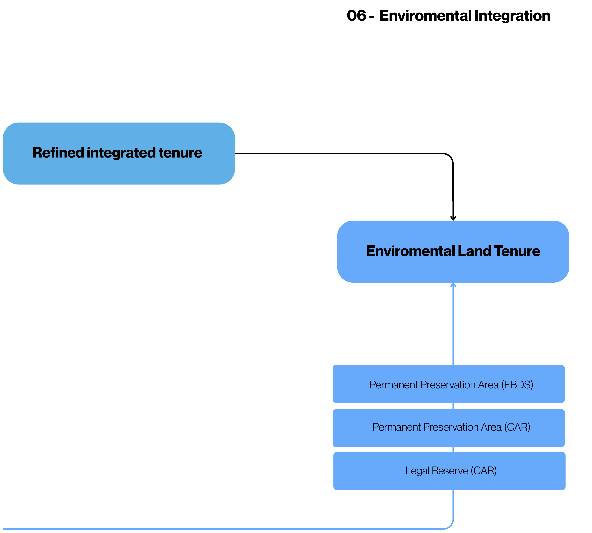

# 06. Environmental Integration

Final stage responsible for integrating environmental assets into the consolidated land tenure, resulting in a single base that associates territorial structure, land use, and environmental information, allowing national-scale analyses.
** **

## How it Works

01. **Incorporation of environmental assets:** Permanent Preservation Areas (APPs), land use and land cover, and Legal Reserves (RL) are integrated into the land tenure data.

    **APPs:**
    
      - FBDS for all biomes, except Pampa and Pantanal
      - CAR for Pampa and Pantanal (due to the absence in FBDS)

    **Legal Reserve:**
    
      - Extracted exclusively from CAR (property level)

3. **Treatment of APPs and RL:** APPs are grouped by land use class, with the removal of sliver polygons.
RL is aggregated by property code (CAR).

4. **Elimination of overlap between assets:** The overlap between APP and RL is performed. In case of intersection, the APP is maintained and the excess RL is removed. This avoids double counting in the calculation of environmental assets and liabilities.

5. **Association with the land tenure:** The environmental assets are overlaid on the land tenure data. Each asset receives the code of the corresponding land tenure class, allowing the identification of its territorial ownership.

6. **Generation of the enviromental land tenure dataset:** All layers are integrated into a single base, consolidating land tenure and environmental information.

## Generated Products

The process results in three main subproducts:

* Final Environmental Land Tenure Class (vector): Consolidated vector structure (hard class)
* Final Environmental Land Tenure Class (raster): Raster representation of the land tenure (hard class)
<!-- * Overlap dataset (raster): Raster with the number of overlaps per pixel -->
