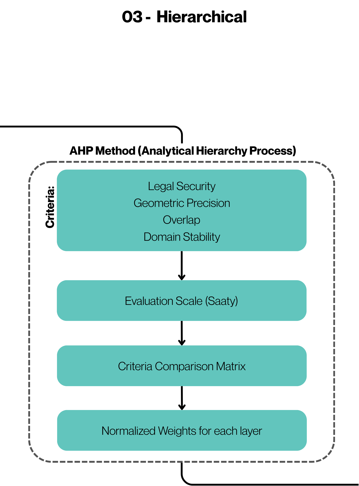

# 03. Hierarchical of Land Tenure Layers

This stage is responsible for identifying areas with spatial conflict — where two or more polygons from different databases coexist — and defining which land tenure class should prevail in the environmental land tenure data.
** **

## AHP Method (Analytic Hierarchy Process)

The resolution of overlaps is performed using the AHP (Analytic Hierarchy Process) multicriteria method, which allows assigning relative weights to the different land tenure layers based on technical criteria.

Four main criteria were considered:

1. **Legal Security:** Degree of legal backing and formal recognition of the layer
2. **Geometric Precision:** Quality and spatial accuracy of the data
3. **Overlap:** Robusteness of the layer in the face of spatial conflicts
4. **Domain Stability:** Permanence and historical consolidation of land occupation

## Evaluation Scale (Saaty)
The weights were defined based on the Saaty scale (1 to 9), used for pairwise comparisons:

* **Weight 1 - Equal Importance:** The two activities contribute equally to the objective.
* **Weight 3 - Moderate Importance:** Experience and judgment slightly favor one activity over the other.
* **Weight 5 - Strong Importance:** Experience and judgment strongly favor one activity over the other.
* **Weight 7 - Very Strong Importance:** An activity is strongly favored and its dominance is demonstrated in practice.
* **Weight 9 - Extreme Importance:** The evidence favoring one activity over the other is of the highest possible order of affirmation.

Note: The values 2, 4, 6, and 8 are used when there is doubt in the effective definition of the weight value.

## Criteria Comparison Matrix

### Table 1: Criteria Weight Matrix
| Criteria | Legal Security | Geometric Precision | Overlap | Domain Stability |
| :--- | :--- | :--- | --- | :--- |
| Legal Security | 1 | 3 | 5 | 7 |
| Geometric Precision | 1/3 | 1 | 3 | 5 |
| Overlap | 1/5 | 1/3 | 1 | 3 |
| Domain Stability | 1/7 | 1/5 | 1/3 | 1 |

## Normalized Weights for each layer
From the normalization of the matrix, the final weights of each criterion were obtained:

### Table 2: Normalized Criteria Weight Matrix
| Criteria | Legal Security | Geometric Precision | Overlap | Domain Stability | Average (Weight) |
| :--- | :--- | :--- | :--- | :--- | :--- |
| Legal Security | 0.599 | 0.662 | 0.536 | 0.438 | 0.56 |
| Geometric Precision | 0.198 | 0.221 | 0.322 | 0.313 | 0.26 |
| Overlap | 0.120 | 0.073 | 0.107 | 0.188 | 0.12 |
| Domain Stability | 0.084 | 0.044 | 0.035 | 0.063 | 0.06 |

## Matrix Consistency Verification

To ensure the mathematical validity and mathematical rigor of the pairwise comparison judgments, the Consistency Ratio ($RC$) was computed based on Saaty's method. 

### 1. Weighted Sum Vector ($WSV$)
The calculation maps the pairwise comparison matrix ($A$ from Table 1) multiplied by the average weights vector ($w$ from Table 2):

$$WSV = \begin{bmatrix} 1.0 & 3.0 & 5.0 & 7.0 \\ 0.3333 & 1.0 & 3.0 & 5.0 \\ 0.2 & 0.3333 & 1.0 & 3.0 \\ 0.1428 & 0.2 & 0.3333 & 1.0 \end{bmatrix} \times \begin{bmatrix} 0.56 \\ 0.26 \\ 0.12 \\ 0.06 \end{bmatrix} = \begin{bmatrix} 2.3600 \\ 1.1066 \\ 0.4986 \\ 0.2320 \end{bmatrix}$$

### 2. Maximum Eigenvalue ($\lambda_{max}$) Estimation
The maximum eigenvalue is calculated by the average of the elements resulting from the division of $WSV_i$ by $w_i$:

$$\lambda_{max} = \frac{1}{4} \left( \frac{2.3600}{0.56} + \frac{1.1066}{0.26} + \frac{0.4986}{0.12} + \frac{0.2320}{0.06} \right)$$

$$\lambda_{max} = \frac{1}{4} (4.2143 + 4.2561 + 4.1550 + 3.8667) = 4.1230$$

### 3. Consistency Index ($IC$)
The Consistency Index ($IC$) measures the deviation from consistency where $n = 4$ criteria:

$$IC = \frac{\lambda_{max} - n}{n - 1} = \frac{4.1230 - 4}{4 - 1} = 0.0410$$

### 4. Consistency Ratio ($RC$)
Using the Random Index ($IR$) proposed by Saaty for $n = 4$ matrices ($IR = 0.89$), the final Consistency Ratio ($RC$) is achieved:

$$RC = \frac{IC}{IR} = \frac{0.0410}{0.89} = 0.0461 \implies 4.61\%$$

> **Conclusion:** Since $RC = 4.61\%$, which is strictly less than the **10%** threshold ($RC < 0.10$), the matrix exhibits high mathematical consistency. The assigned weights are scientifically valid and mathematically sound for deployment within the spatial analysis and data integration pipeline.
