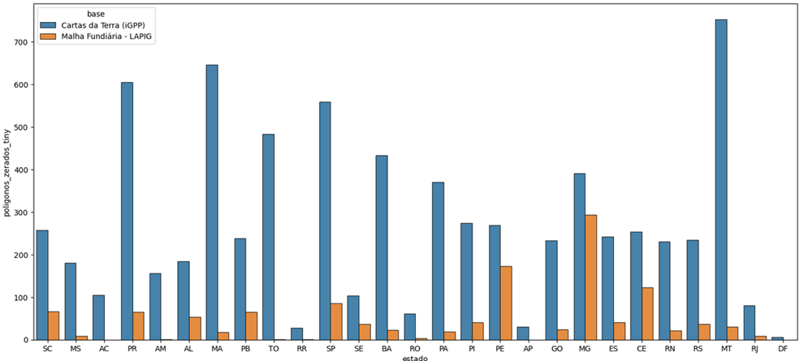
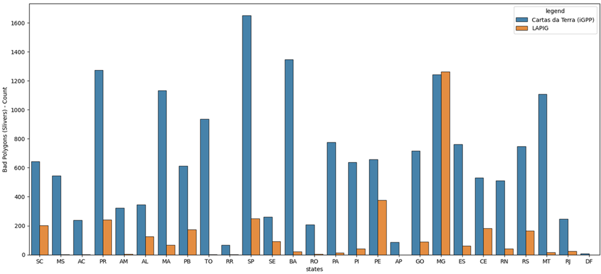
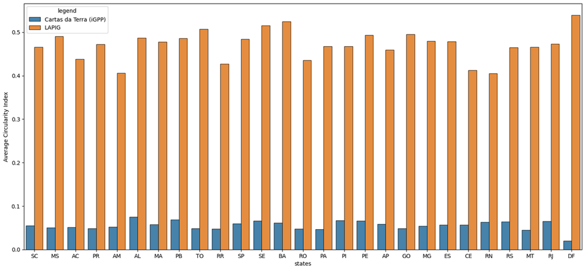
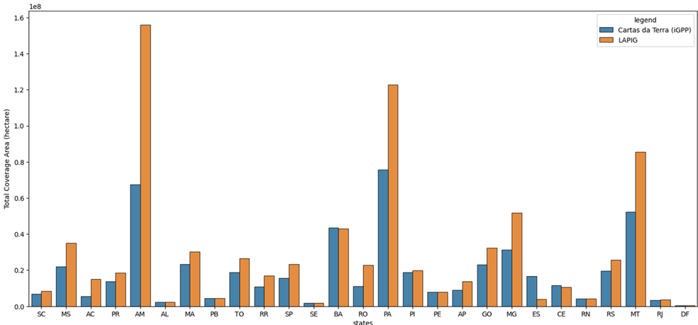

# 07. Métricas de Avaliação das Malhas Fundiárias 

Nesta etapamostra  a estrutura metodológica aplicada na avaliação comparativa de integridade geométrica e topológica entre as bases de dados espaciais Malha Fundiária - LAPIG e Cartas da Terra (iGPP). Nesta análise, não foi contabilizado as áreas de vazio fundiário da malha fundiária da Cartas da Terra (iGPP).

## Métricas utilizadas

01. **Área de Cobertura:** etermina a extensão territorial total mapeada por cada base de dados (geralmente calculada em hectares ou quilômetros quadrados). Ela permite validar a completude do dataset em nível nacional ou regional, servindo como indicador de subdimensionamento ou sobreposição massiva de área.
02. **Polígonos Zerados (Tiny Geometries):** Identifica polígonos com áreas nulas, geometrias colapsadas ou áreas microscópicas irrelevantes (ruídos gerados por erros de processamento, cálculo de interseções mal executadas ou problemas de digitação de coordenadas). Em ambientes produtivos de bancos de dados espaciais (PostGIS), registros desse tipo geram gargalos de processamento desnecessários.
03. **Polígonos Ruins (Slivers):** Slivers são polígonos "agulha", extremamente longos e finos. Eles ocorrem quase sempre devido a falhas de aderência topológica (snap) entre limites de propriedades vizinhas, gerando frestas vazias ou pequenas faixas de sobreposição dupla. Medir a quantidade de slivers é o principal termômetro para avaliar o nível de sujeira topológica de uma malha. Nesse caso, foram considerados Slivers polígonos com o índice de circularide e área abaixo de 0,12 1000m² respectivamente
04. **Índice de Circularidade Médio:** Avalia o fator de forma dos polígonos (geralmente aplicando a fórmula de Polsby-Popper). O índice varia de $0$ a $1$, onde valores próximos a $1$ representam círculos perfeitos ou formas muito compactas, e valores próximos a $0$ representam geometrias altamente ramificadas, lineares ou retorcidas. Em malhas fundiárias, uma circularidade excessivamente baixa em milhares de registros costuma ser um forte indicativo de distorções cartográficas ou geometrias corrompidas.

## Resultados, Gráficos e Valores Obtidos 
Segue os resultados das métricas sobre as malhas fundiárias em análise em relação ao Brasil 

| Métrica Analisada | Malha Fundiária - LAPIG | Cartas da Terra (iGPP) | 
| :--- | :--- | :--- |
| Área de Cobertura Total (ha) | 786,561,030 | 523,703,056 |
| Quantidade de Polígonos Zerados | 1,239 | 7,485 |
| Quantidade de Slivers | 3,460 | 17,804 |
| Índice de Circularidade Médio | 0.46 | 0.05 |

### Gráfico 1: Polígonos Zerados (Tiny) por Estado (Empilhado)
Demonstra o volume acumulado de geometrias nulas ou microscópicas divididas por unidade federativa, facilitando a identificação dos estados que necessitam de limpeza topológica imediata

### Gráfico 2: Quantidade de Polígonos Ruins (Slivers) por UF e Tipo de Malha
Nível de ruído, evidenciando o comportamento estrutural de cada instituição por estado

### Gráfico 3: Índice de Circularidade Médio por UF
Análise de dispersão da forma geométrica identificando os picos de melhor consistência (Máximo) e os vales de maior distorção (Mínimo).

### Gráfico 4: Área de Cobertura Total em hectare por UF
Avaliar a cobertura Total das malhas fundiárias por UF

