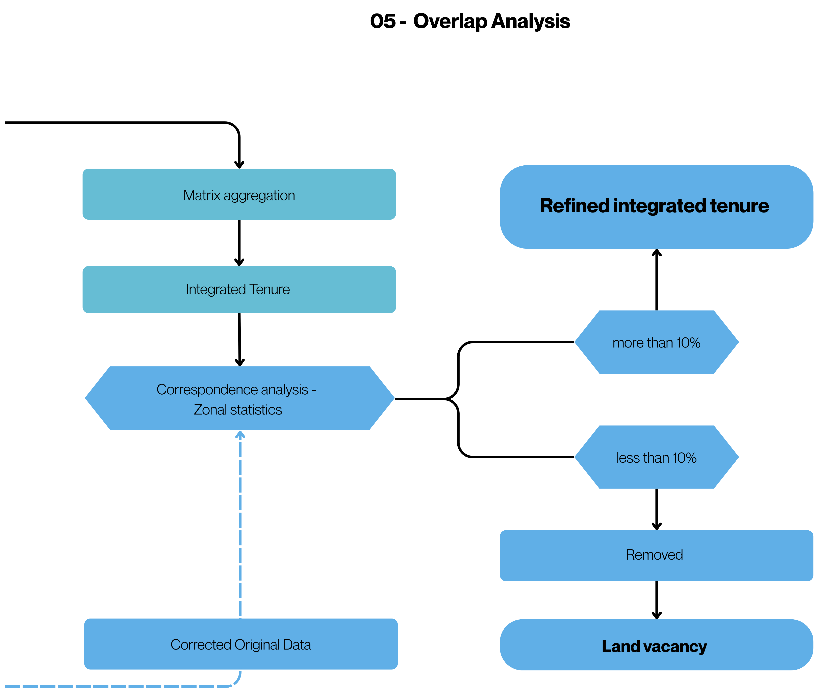

# 05. Overlap Analysis

This stage is responsible for identifying areas with spatial conflict — where two or more land tenure layers coexist — and objectively defining which class should prevail in the environmental land tenure final.
** **

## How it Works

01. **Raster aggregation:** The consolidation of the layers is performed through map algebra, applying a pixel-by-pixel minimum operation among all raster images. Since pixel values represent the land tenure hierarchy, the lowest value corresponds to the highest priority class, being selected to compose the final land tenure.
02. **Generation of the integrated land tenure:** The result of the aggregation is a single continuous raster, in which each pixel represents the dominant land tenure class, without overlaps or gaps.

** **

** **
## Vector Refinement

After generating the land tenure data in raster format, each original vector feature is compared with the dominant class in the final land tenure.

If more than 10% of the feature's area coincides with the same class in the raster, the vector is kept and adjusted, being clipped according to the limits defined by the enviromental land tenure dataset.

Otherwise, the feature is discarded due to insufficient correspondence, generating a land tenure void.

In the final stage, classes are integrated respecting the land tenure hierarchy:

* Higher priority classes are kept
* Lower priority classes are clipped in overlap areas

** **
## Process Results
- Areas without overlap are incorporated directly.
- Areas with overlap go through weighted hierarchy, generating a mesh without voids or duplicates, with traceable decisions.
